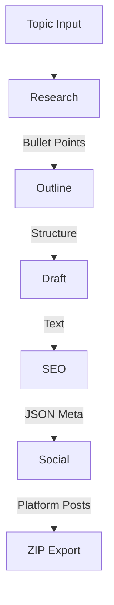

# AIContentPipeline

[](https://nextjs.org/)
[](https://js.langchain.com/)
[](https://opensource.org/licenses/MIT)

AIContentPipeline is a Next.js application that runs a 5-step sequential pipeline to generate content. It uses LangChain.js to interface with external LLM APIs (Gemini, OpenAI, Anthropic) or local inference servers. The application is entirely client-side driven and stateless.

---

## Technical Architecture

The system operates without a database or backend storage. It uses a "Bring Your Own Key" (BYOK) model.

### Pipeline Logic
1.  **Orchestration**: Supports Gemini, OpenAI, Anthropic, and Local (OpenAI-compatible) providers. Users can set a single global provider or configure specific providers for individual steps.
2.  **Execution**: Built on Next.js 15 App Router. The backend uses Server-Sent Events (SSE) to stream generation progress to the client.
3.  **Chains**: Uses LangChain (LCEL) to define isolated prompt chains for each step.
4.  **Context**: The output of each step is passed as context into the subsequent step.

---

## Security Model

The application uses volatile memory for credentials.

- **Client-Side Keys**: API keys are provided via the UI and kept in React state.
- **No Persistence**: Keys are not saved to `localStorage`, databases, or cookies. Reloading the page clears the keys.
- **Local Provider**: The application supports connecting to local inference endpoints (e.g., `http://localhost:11434/v1`) to run the pipeline without sending data to external APIs.

---

## Workflow Execution Flow

The pipeline executes five steps in order. Users can review and edit the output of each step before proceeding to the next.



---

## Directory Structure

```text
aicontentpipeline/
├── src/
│   ├── app/
│   │   ├── api/pipeline/
│   │   │   └── route.ts         # SSE API Route
│   │   ├── layout.tsx           # Global Layout
│   │   ├── page.tsx             # Main UI
│   │   └── globals.css          # Tailwind CSS
│   ├── components/
│   │   ├── PipelineStep.tsx     # Step Component
│   │   └── Stepper.tsx          # Progress UI
│   ├── lib/
│   │   ├── chains/              # LangChain Logic
│   │   │   ├── research.ts
│   │   │   ├── outline.ts
│   │   │   ├── draft.ts
│   │   │   ├── seo.ts
│   │   │   └── social.ts
│   │   ├── export.ts            # ZIP Generation
│   │   ├── models.ts            # LLM Instantiation
│   │   └── utils.ts             # Helpers
│   └── types/
│       └── pipeline.ts          # TypeScript Types
├── next.config.ts               # Next.js Config
├── tailwind.config.ts           # Tailwind Config
└── package.json                 # Dependencies
```

---

## Installation

### Prerequisites
- Node.js 20.x or higher

### Setup

1.  **Clone Repository**
    ```bash
    git clone https://github.com/GaneshArwan/AIContentPipeline.git
    cd AIContentPipeline
    npm install
    ```

2.  **Start Development Server**
    ```bash
    npm run dev
    ```

3.  **Usage**
    Open `http://localhost:3000` in a browser. Input a topic, provide the necessary API keys, and click Execute.

---

## License

Distributed under the MIT License. See `LICENSE` for more information.
